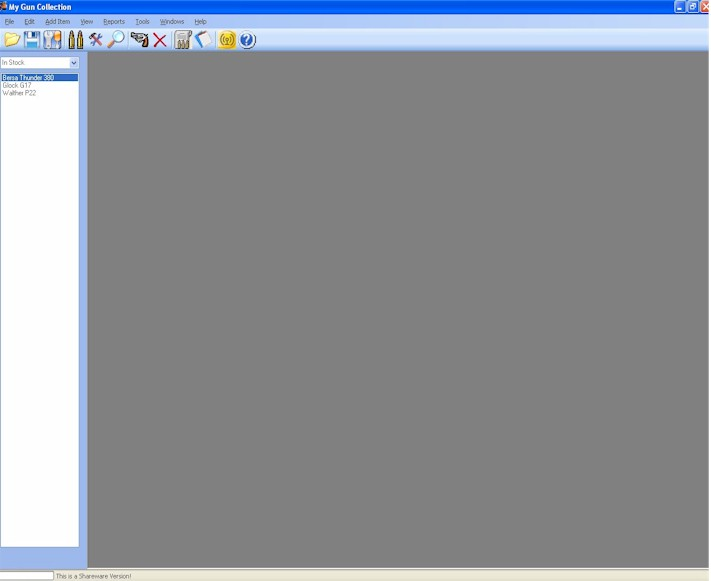
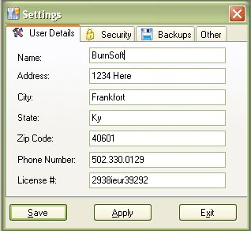

# Starting Out - On Load Settings

When you first start the application, it will ask you for your information.  This information will store your information for other parts of the application.  Right now One thing that is used if your name and Phone Number for the "For Sale" Flyer.  But the Name is only required.

Other than the name, fill out the rest of the information at your discretion. The License Number Can be Anything from your Drivers License, Conceal Carry License, C & R License or FFL.

One you have put in you name and other information, click on the Save button to save the information and exit the form.

 
Now you can [Add a Firearm to the Application](Starting_out_Adding_A_Firearm.md).