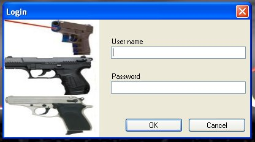
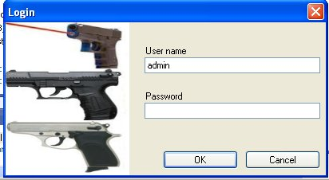

# Logging In

You can lock down the application by apply a password in the Setting Section.   Once you apply the password, you will be prompted with the following window next time you start up the application

the Default and only user name is admin.

The password will be the password that you supplied in the setting section.

Once you have the username of admin and your password, click on the Ok button to log into the application.
