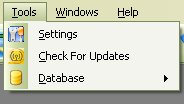

# Settings

When you first started this application it asked you for your information.  The Settings section is that same window that you saw when you first started this application.  To Access the settings window, just click on Tools, then Settings on the Menu Bar.

Other than the name fill out the rest of the information at your discretion.

