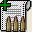
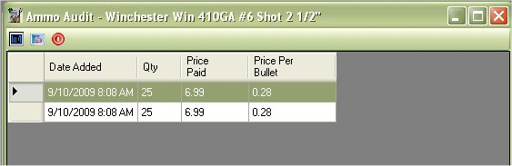

# Viewing the Ammunition Audit List

The ability to audit the cost of ammunition was added in version 4.   This allows you to keep track of how much you paid for that ammunition on the purchase dates.  Some people tend to mark the ammunition boxes with the date it was bought, in order to cycle out old ammunition and some will mark it as the date it was bought and would sell that ammunition.  The audit will allow people to know how much they paid for that ammunition based on the date.  Others will use it to see the fluctuation of ammunition prices over the years.

To Access the Ammunition Audit List, you will need to be viewing the ammunition inventory list.  Select the ammunition that you are interested and click on the following icon on the tool bar  to bring up the following information.

Currently there is not much to this list. It's mostly for viewing information.