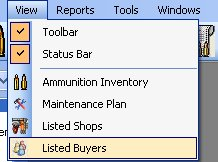
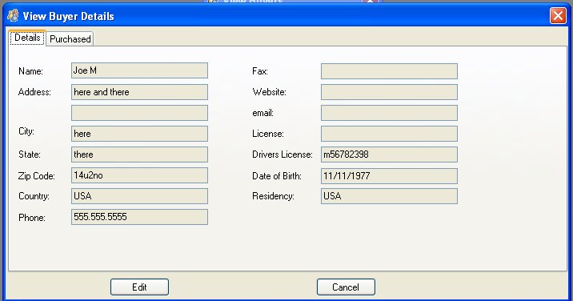

# Viewing Listed Buyers

Since this application is keeping track of who you sold your firearm to, we thought it was best to make a quick and easy way to view the people that have bought your firearms.

To Access the Buyers list just Click on View on the menu bar and then click on Listed Buyers, to bring up the following window.

Double click on the Buyers Name to view more information:

As you can see we have all the information needed about the buyer, if you wanted a list of the Firearms that you sold to this person, just click on the Purchase tab to view that list.

[Click here](Editing_Buyer_Details.md) to learn how to Edit the Buyers Details