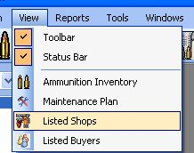
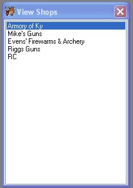
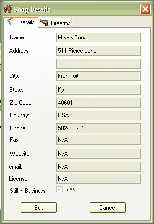

# Viewing Listed Shops

The Shops are added to the database when you put in the place that you got the firearm in the Purchased From field in the Add/Edit Firearm form, this information is mostly kept for the Bound Book report.  But if this a regular gun store that you purchase from, we decided to also allow you to enter in detail information about the store, so you can quickly look them up if you had to.

To view the List of Shops that you have purchased firearms from, click on View in the menu bar and then click on Listed Shops.  Then the following window will appear.

To view the details of that shop or person that you have bought a firearm from, just double click on the name to bring up the following window:

[Click here](Editing_Shop_Details.md) to learn how to edit or add to the Shop Details.

