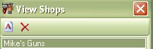
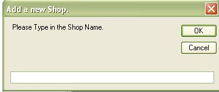
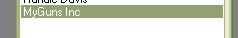

# Adding a Shop to the List

By Default, when you are adding or editing a firearm in your collection and you put a shop in the "Purchased From" field, it will automatically add the Shop to the database.  This section will show you how to add a shop to the database without having to enter in a firearm.

When you are viewing the list of shops, you can easily add another shop to the list by clicking on the paper with an A(  ) icon on the tool bar.  By Adding another shop in advance it will come up in the list of shops when you are adding or editing a firearm.  You can also add another shop to the list just to keep track of the contact information for that store.

Once you click on the "Add Icon" (  ), the following input box will appear:

Type in the name of the shop that you wish to add and click on the Ok button to add it to the database.

Now you can see it in the List of Shops.  To Add additional information to the shop, just double click on the shop name to bring up the "View Shop Details" window.  From there you can click on the Edit button to add the information.

[Click here](Editing_Shop_Details.md) to learn how to edit or add to the Shop Details.

Since some people are not completely concerned about the details of the shops still later, we designed it this way to allow you to enter in the names of the shops that you are interested in first, then on your free time you can add to that information as needed.

