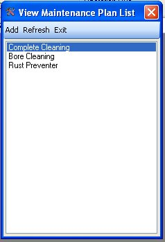
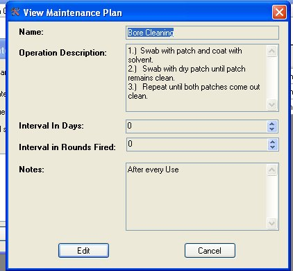
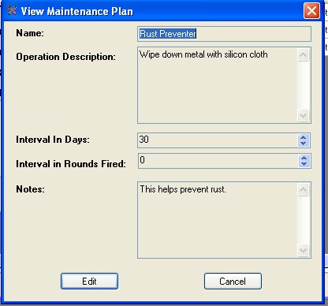

# Viewing a Maintenance Plan

The Maintenance Plans are steps that you take to take care of your firearm, in order to keep it in working condition.  This application comes with 3 maintenance plans that are commonly used among other firearm collectors.

To view the list of these maintenance plans, just click on View in the menu Bar and select Maintenance Plan to bring up the following window:

Just Double Click on plan that you wish to view to bring up any of the following windows:

While you are viewing the maintenance plan, you can edit it just by clicking on the Edit button.  Click here for more details on [Editing Maintenance Plans](Editing_a_Maintance_Plan.md).

From the Plan list, you can also Add, Refresh or Exit the list.

For more information on how to add your own maintenance plan, [click here](Adding_Maintance_Details.md) for more information.