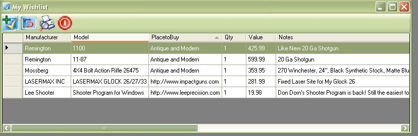
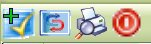
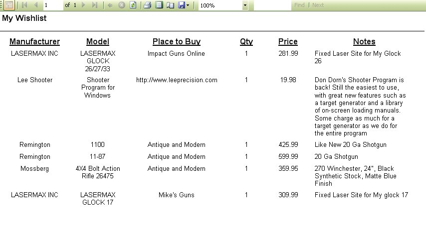
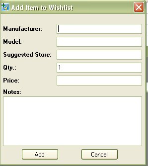
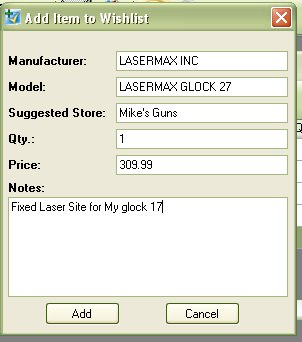
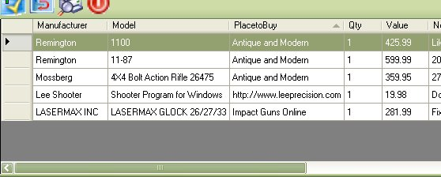
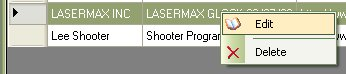
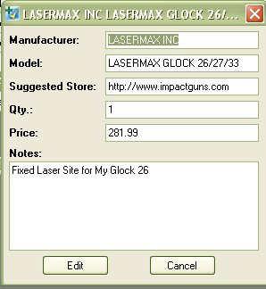
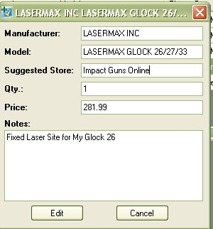

# WishList

The Wishlist section was created to help you keep track of all the firearms and accessories that you would like to have.  They parameters for the list is pretty generic which will allow you to type a firearm, and accessory for a firearm, cleaning materials, cases, standing targets, straps, etc.

## Viewing the Wishlist

To view the wish list. just click on the Golden Checkmark icon (  )on the tool bar on the main window to bring up the following window.

From this window, you can view, edit, add, or delete items in your wish list.

There isn't much to the tool bar on the wishlist.  The first icon (   ) on the left will allow you to add an item to the wish list. 

The Second icon from the left is the refresh button, which will allow you the refresh the list after you have added or made changes to an item.

The 3rd icon from the left is the Printer Friendly report.  This will bring up another window which will display how these items will look if you printed it out.   Below is an example of how the report would look if I printed it out.

From this window, not only can you print it out, but like the rest of the reports with this application, you will be able to export the information to Microsoft's Excel or export the information to a PDF file.

The 4th and last icon on the tool bar is the close button, you can exit the wishlist by clicking on this button.

## Adding an Item

You can add an item to the wish list by clicking on the icon with the golden check mark and the plus sign in the top left corner (  ), which is located on the tool bar of the main window and the Wishlist window.  Once you click on that icon, the following window will appear.

As you can see, it is pretty generic, all you need to do is:

* Type in the Manufacturer
* Type in the Model
* Type in the store or website that you saw it at
* You can the option that state you want more than 1 of this item.
* The price that you saw it for at the store
* And any additional notes about the item.

FEATURE: This section will also read the wishlist database that you currently to help with suggestions when you are adding to the list.

Once you have entered in the information, click on the Add button to save it to the database.

## Editing an Item

While viewing the list, you can edit an item by double clicking on the selected item or you can right click on the item and select Edit from the drop down menu.

When you double click or select from the menu, the following window will appear.

Make any changes or additions that you wish to make to this listing.

Once you have made the changes click on the Edit button to save and exit.

## Removing an Item

While viewing the list, you can delete an item by clicking on the item once to select, the by right clicking on your mouse to bring up the menu

When you select delete from the menu, it will ask if you if you are sure that you wish to delete the selected item.  Click on the Yes button to delete the item from the wishlist.
