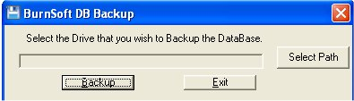
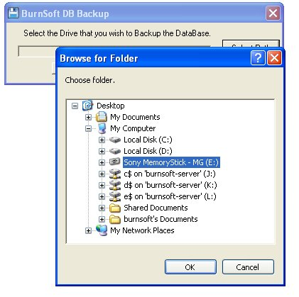
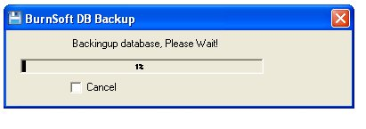
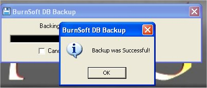

# Backing up your Database

Why would I need to Backup my Database (dB)?  Well this is just a safety measure for your day to day business operations.  If you had to restore your current PC, which involves wiping out everything and reinstalling it, or if you PC crashes, at least you will have your dB handy once you reinstall this program.

To backup a database to a disk while in the program, click on picture of an open folder (  ) or you can hit you "F9" key.  This will close out the "Apartment Manager" program and bring up the following window:

 

Why Did the "Apartment Manager" program close out?  Well in order to free up the database(dB) that the program was using, we had to let the program go.  From the "BurnSoft.Net DB Backup" program, select the drive that you wish to backup the database to.

 

After you select the drive that you wish to backup the dB to, click on the "Backup" button.

 

 

If the program successfully backed up the dB, or if there was an error, a message box will come up and tell you.

**We recommend that should be done at least once a month.**