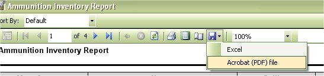
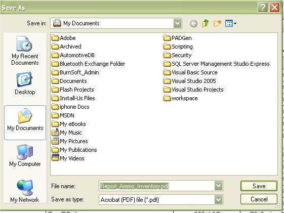
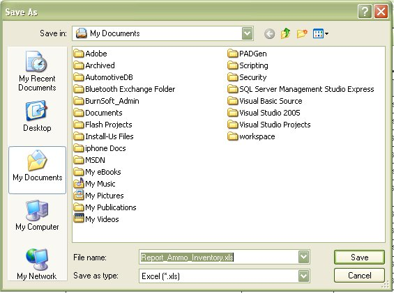
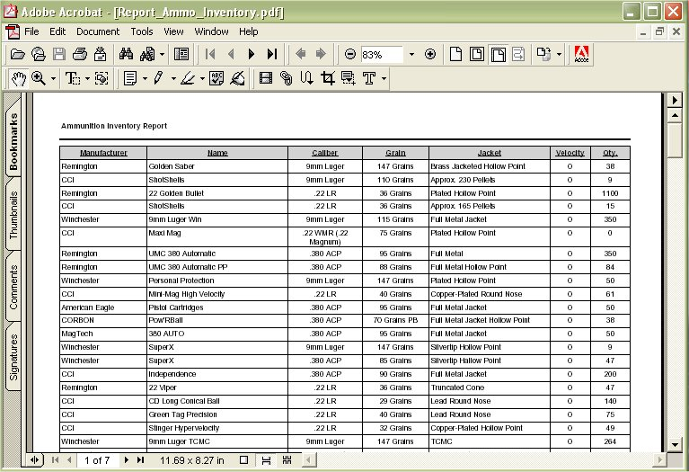
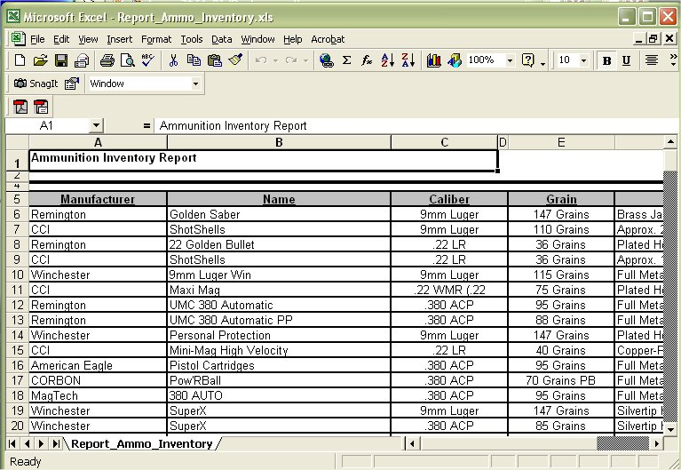

# Exporting Reports to PDF or Excel Files

Besides being able to print all the stock reports, you are also allow to save/export those reports to a PDF or Excel file.

While viewing the report look at the tool bar that you would normally use to send the report to the printer.  One the right hand side you will notice an icon of a disk, just click on the disk to pull down the options.

As you can see there are only two options, Excel and Acrobat (PDF) File.

Click on the file format that you wish to save the report as.

Or

Once the report is saved, just go to the location where you save it at and click on it to view it in the default program for that file type.

Or

