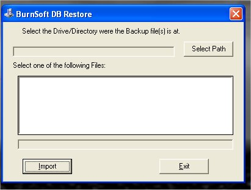
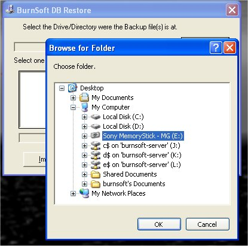
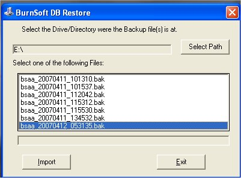
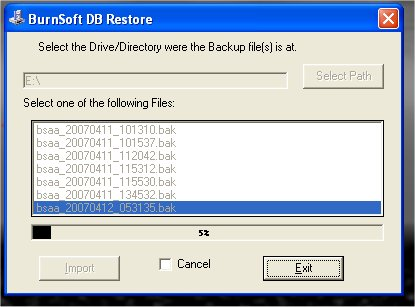
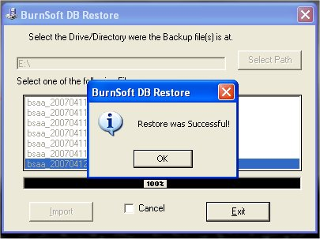

# Restoring a Database

Why would I need to Import (Restore) my Database?   Well, in the case of installing this program on a new PC, or your current system crashed and you are restore the program, this will help you retrieve the information that you backed up.

To Import a database that you have on Disk while in the program, click on picture of an open folder (  ) or you can hit you "F11" key.  This will close out the "My Gun Collection" program and bring up the following window.

Why Did the “My Gun Collection” program close out?  Well in order to free up the database(dB) that the program was using, we had to let the program go.  From the "BurnSoft.Net DB" Restore program, select the drive that you wish to get the database from.

After you select the drive that you wish to get the dB from, Select the Backup that you wish to restore.

Now Click on the "Import" button to restore the database.

If the program successfully import the dB, or if there was an error, a message box will come up and tell you.