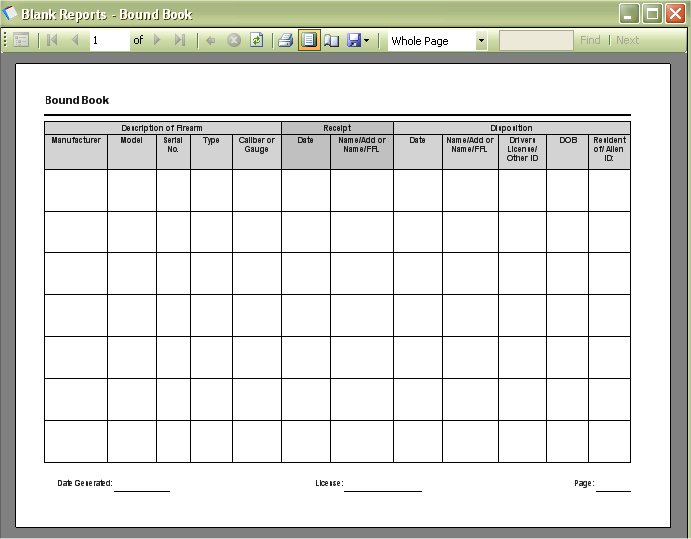

# Blank Reports - Bound Book

We have had a number of requests for a blank bound book, so you manually enter in data in the sheet, then plug it into the program later on.  Now we have create a blank bound book that will allow you to print out as many copies are you need for you manual input needs.

Just click on "Report | Blank Reports | Bound Book" to bring up the following window.

As you can see it is how the report will look when you print it out.  To print out the report, just click on the Printer icon (  ) that is located on the menu bar on the report, once you click on that the Print Options will appear:

Of course you also have the option to save the report to an Excel or PDF file.  To Learn more [Click here](exporting_reports_to_file.md).