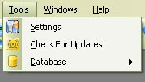

# Backup Settings and Alerts

When you first started this application it asked you for your information.  The Settings section is that same window that you saw when you first started this application.   To Access the settings window, just click on Tools, then Settings on the Menu Bar.

From the Settings window, you are also set it up to help you keep track of your backups.  In the Backup tab, you have the options of

* Having the application Alert you if the last backup is greater than x amount of days.
* Have it delete backups that are older then x amount of days
* And Set the x number of days that you want to be alerted on and for it to keep newer backups from the last amount of days.

Just Click on the Check Boxes to set the Alert on Last Backup Time, Backup on Exit and Automatically Delete Old Backups.

The Backup on Exit was added in Version 3.x.  This will allow you to backup the database every-time when you exit the My Gun Collection application.  This is just a safety feature if you want to have the latest and greatest copy of your database.

By Default, it will alert and track the last 30 days, which you can set to a longer or shorter time.

NOTE: As a safety precaution, it will keep the last 6 backups even if they are greater than the set number of days.  Since sometimes we are not able to add information about our gun collection for a month or longer, it would be pointless to delete all the backups if we haven't had the need to use the this application for a few months.

Once you are Finished, you can click on Apply to save the changes or you can click on Save to Save the Changes and exit the settings section.