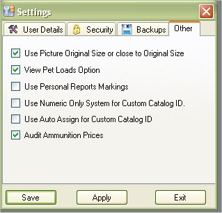

# Other Settings

Optional Viewing Settings have been put in place since Version 3.x, due to conflicts of interest in what people like to see in the application and some that do not care about that option, we decided to put some options out there that will allow you to use the feature or not.  Right now we just have 2 items on that list.

**Use Picture Original Size or Close to original size**

In version 1 and 2 of the My Gun Collection application, when you click on the picture it would open in another window and it would stretch the image to the size of the window.  If you used it for mostly handguns then you might not have noticed it much, but it does make it difficult when you are viewing a rifle.  You can always stretch the window size from a square to a rectangle to get the rifle picture to look the way it is suppose to, but it wasn't as easy as just click to open and view.   We've only heard 1 person about this issue and those of us that have rifles have noticed that as well, so in version 3.x we decided to have the option of viewing the image as it did in version 1 and 2 or you can click the check box near Use Picture Original Size or Close to original size to have it calculate the size of the picture against the current work space and try to keep a proper ratio of the picture.

**View Pet Loads Option**

Some people use the Pet Loads option when Adding, Editing or Viewing a firearm and some don't use it at all.  Personally I didn't start using it until I got my AR-15, had 5.56 in one field and .223 in the other.  5.56 and .223 are the same thing, but if you use the ammo inventory and type in what the box says, you won't get a proper listing when you are viewing the available ammunition for the selected firearm that you are using.

But if this is a feature that you do not need, you can always uncheck the box marked "View Pet Loads Option" to have it display on the Add, Edit and View Forms.

**Use Personal Report Markings**

The personal report markings will put a small water mark at the bottom of each report stating that it was printed out by you.  This is just a good way to keep track of the report and also for anyone that is viewing the report.

**Use Numeric Only System for Custom Catalog ID**

By Default the Custom Catalog ID system is text based, which can mess with any reports that you might have if you are using a basic numbering system such as 1, 2, 3, 4, etc.   When in Text mode, it will organize 1- 20 as 1, 10, 11, 12, ....,19, 2, 20.   Now you can switch it to a pure numeric system which will only allow numbers to be used and will also correct the 1, 10, 11, 12, ....,19, 2, 20 order.

**Use Auto Assign for Custom Catalog ID**

You can have the My Gun Collection application Auto Assign the Catalog ID based on the last number that was used.  Good only when "Use Numeric Only System for Custom Catalog ID" is enabled.

**Audit Ammunition Prices**

For those that wish to keep track of the cost of ammunition through out the months or years, you can now keep track of the prices of each box of ammunition that you buy.   See Ammunition Qty with Auditing for more Details.