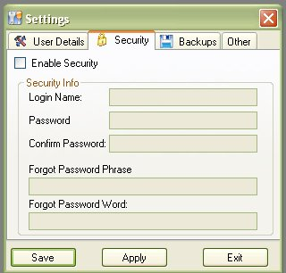

# Security Settings

In version 1.x and 2.x in order to lock the application, you can set a password in the Settings section for the application so when the next time you ran the application, it will ask you for a username and password (See Logging In Instructions for more details ).  Only problem with that method it that the default user name was "admin"  which was forgot our just unknown to those that used it.  Since we try to make this application more personal to you, we got rid of the default "admin" user name and allow you to create your own username as well as a password.  In the older Versions of My Gun Collection, the Second Tab in the Settings window was called "Password", which has been changed to "Security" in version 3.x.

To access the security settings, just click on the tab marked "Security" in the settings window ( to learn how to access the settings, click here )

To start using the security feature, just click on the Enable Security check box to enabled the login name and password(s) text box.

Once the  login name and password(s) text boxes are enabled, type in the username that you wish to use and type the password twice.  Twice to make sure you have the typed the password correctly since you will not be able to see what you typed in. 

The UserName is not required, but the password is.  If you do not type in a user name, the default "admin" will be used.

Now just incase you forget your password, we now have a "Forgot Password" feature on the login screen.  The Forgot Password Phrase and Word fields are required!  Type in the Phrase that you wish to use, and the word that is the answer.   It doesn't exactly have to be 1 word, you can have the rest of the phrase sentence in the word section.  Just as long as it is something that you can remember.

Once you have created the username and password that you wish to use, click on the Save or Apply button to save your changes.  Now next time that you run the program it will ask you for a username and password ( see [Logging in](Tools_Logging_in.md) for more details ).